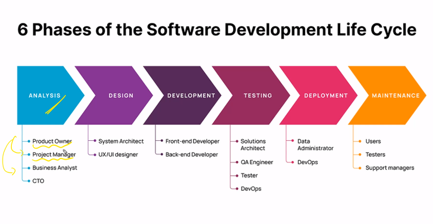
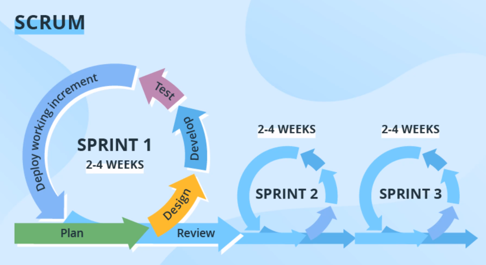

# Notes

## Problem Solving

### Data Structures

- Linear

  - Array
  - Stack
  - Queue
  - Linked List

- Non Linear
  - Graph
  - Tree
    - Binary Tree
    - AVL Tree
      - LL
      - RR
      - RL
      - LR

> Balance Factor = Height(left) - Height(right)

```python
# Variable Declaration
x = 10
y = x+10
```

### Shortcut

- `Alt + (up/down)` - Move Line up or down

* `ctrl + / ` - Comment

- `ctrl + shift + p` = Command Pallet

## Software LifeCycle

- Planning
- Analysis
- Design
- Implementation
- Testing & Integration
- Maintenance

### Stakeholders

People who are responsible of the Product



## Agile

Extremely Flexible with Monthly releases
Can gain Customer Feedback after each release and improve the product

- Requirements
- Design
- Development
- Delivery
- Maintanance

### Implementation of Agile (Scrum)



Scrum Master - Assigns the tasks

Story Points - Number of days or hours the task will take to complete (fibonacci numbers)

- Sprint Planning - 2hr meeting

- Standup Meetings - Will take place everyday for 15min where they will discuss the progress, challenges faced.

- Sprint Retrospect - Retrospecting 1 hr

- Sprint Review - Review the whole thing

### Unified View (KanBan Board)

Backlogs are tasks yet to be done, from backlog the tasks will be selected and sent to the Product Backlog

| Backlog | In Progress | Peer Review | Done  |
| ------- | ----------- | ----------- | ----- |
| task1   | task2       | task3       | task4 |
