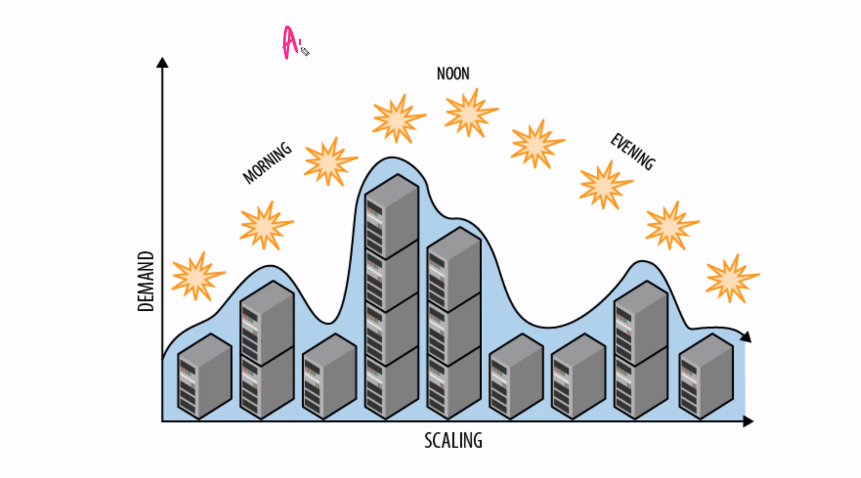
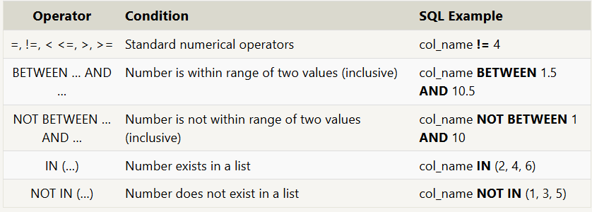
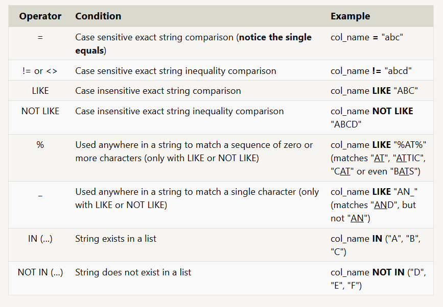
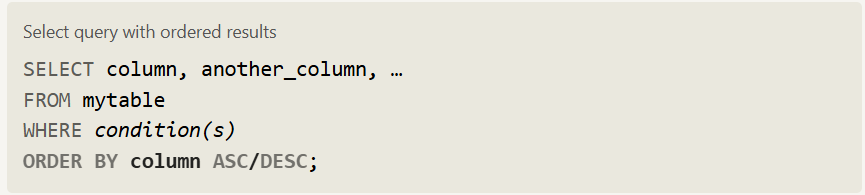
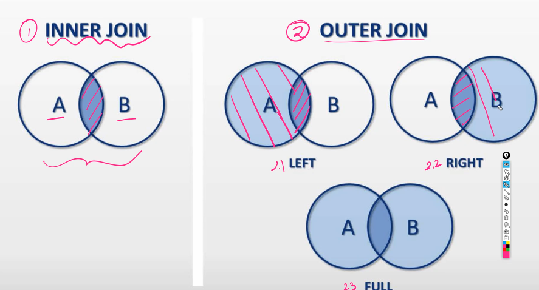

# Databases (SQL Server)

Cloud - Renting PC

- They provide computation power to run processes and software.
- AWS, Azure, Google Cloud

- Cloud Proivders provide Disaster Management

- Buying servers will have its disadvantages like power consumption, maintanance, storage space to place the servers.

- Cloud providers will manage all the necessary things like maintaining the infraustructure.

- Backup servers are stored at different locations across the world so if any disaster happens at one place then the data will be available at another place.

- Linux is mostly used in cloud,

  - Open Source
  - Secure
  - Small Footprint
  - Automation
  - Free

- Alpine Linux is the most used OS in Cloud. (only 256 mb)

### Scaling

- Vertical Scaling

  - Making PC powerful by adding more ram, storage, cpu.

- Horizontal Scaling

  - Add more and more PC's

AWS has the autoscaling capability



Based on the usage and the active customers, more computational power will be added automatically

Auto Scaling can be a disadvantage when there is DDOS attack and there is a automatic upscaling of resources which results in unnecessary lose in money for the owner.

The attack can come from the opponents or hackers


## Why Database ?

- Efficiency
- Fast retrieval
- Data consistency
- Structured Format
- Can be accessed based on the requirements

### Features

- Frequently asked data will be in RAM
- Querying becomes easier
- CRUD beacomes easier
- Backups are inbuilt
- Undo easily
- Performance

### SQL vs NoSQL

SQL - Stores in tables

NoSQL - Stores in documents

- Relational Databases (SQL)
  - MySQL
  - PostgresSQL
  - Oracle
- Non Relational Databases (NoSQL)
  - MongoDB
  - CouchDB
  - Redis
  - Cassandra
  - DynamoDB

# SQL

Querying is asking questions

- Select - Select Columns from the table

## Exercise 1 - SELECT

Find the title of each film:

```sql
    SELECT Title FROM movies;
```

Find the director of each film:

```sql
    SELECT director FROM movies;
```

Find the title and director of each film:

```sql
    SELECT Title, director FROM movies;
```

Find the title and year of each film

```sql
    SELECT Title, year FROM movies;
```

Find all the information about each film:

```sql
    SELECT * FROM movies;
```

## Exercise 2 - Where clause

- Where Clause used to add conditions



Find the movie with a row id of 6:

```sql
    SELECT * FROM movies where Id = 6;
```

Find the movies released in the years between 2000 and 2010:

```sql
    SELECT * FROM movies where year between 2000 and 2010;
```

Find the movies not released in the years between 2000 and 2010:

```sql
    SELECT * FROM movies where year not between 2000 and 2010;
```

Find the first 5 Pixar movies and their release year:

```sql
    SELECT title, year FROM movies Where id Between 1 and 5;
```

## Exercise 3 - Queries with constraints



Find all the Toy Story movies:

```sql
    SELECT * FROM movies where title Like "Toy Story%";
```

Find all the movies directed by John Lasseter:

```sql
    SELECT * FROM movies where director = "John Lasseter";
```

Find all the movies (and director) not directed by John Lasseter:

```sql
    SELECT * FROM movies where director != "John Lasseter";
```

Find all the WALL- movies:

```sql
    SELECT * FROM movies where title like "Wall-%";
```

## Exercise 4 - Filtering and sorting Query results

- DISTINCT keyword will blindly remove duplicate rows

```sql
    SELECT DISTINCT column, another_column, …
    FROM mytable
    WHERE condition(s);
```

- ORDER BY clause is specified, each row is sorted alpha-numerically based on the specified column's value.



- Another clause which is commonly used with the ORDER BY clause are the LIMIT and OFFSET clauses, which are a useful optimization to indicate to the database the subset of the results you care about.

```sql
    SELECT column, another_column, …
    FROM mytable
    WHERE condition(s)
    ORDER BY column ASC/DESC
    LIMIT num_limit OFFSET num_offset;
```

- The LIMIT will reduce the number of rows to return, and the optional OFFSET will specify where to begin counting the number rows from.

1. List all directors of Pixar movies (alphabetically), without duplicates:

```sql
    SELECT distinct director FROM movies order by director;
```

2. List the last four Pixar movies released (ordered from most recent to least):

```sql
    SELECT * FROM movies order by year desc limit 4;
```

3. List the first five Pixar movies sorted alphabetically:

```sql
    SELECT * FROM movies order by title limit 5;
```

4. List the next five Pixar movies sorted alphabetically:

```sql
    SELECT * FROM movies order by title limit 5 offset 5;
```

## Exercise - 5

1. List all the Canadian cities and their populations:

```sql
    SELECT * FROM North_american_cities where Country Like "Canada";
```

2. Order all the cities in the United States by their latitude from north to south

```sql
    SELECT * FROM North_american_cities where Country Like "United States" order by Latitude desc;
```

3. List all the cities west of Chicago, ordered from west to east

```sql
    SELECT City FROM north_american_cities where longitude < -87.629798 order by longitude;
```

4. List the two largest cities in Mexico (by population):

```sql
    SELECT * FROM north_american_cities where country = "Mexico" order by Population desc limit 2;
```

5. List the third and fourth largest cities (by population) in the United States and their population:

```sql
    SELECT * FROM north_american_cities where country = "United States" order by population desc limit 2 offset 2;
```

## Exercise - 6 Multi-table queries with JOINs

- Tables that share information about a single entity need to have a primary key that identifies that entity uniquely across the database

- One common primary key type is an auto-incrementing integer (because they are space efficient), but it can also be a string, hashed value, so long as it is unique.

- Using the JOIN clause in a query, we can combine row data across two separate tables using this unique key. The first of the joins that we will introduce is the INNER JOIN

```sql
    SELECT column, another_table_column, …
    FROM mytable
    INNER JOIN another_table
        ON mytable.id = another_table.id
    WHERE condition(s)
    ORDER BY column, … ASC/DESC
    LIMIT num_limit OFFSET num_offset;
```

1. Find the domestic and international sales for each movie

```sql
    SELECT domestic_sales, international_sales FROM movies inner join boxoffice on movies.id = boxoffice.movie_id;
```

2. Show the sales numbers for each movie that did better internationally rather than domestically

```sql
    SELECT domestic_sales FROM movies inner join boxoffice on movies.id = boxoffice.movie_id where international_sales > domestic_sales;
```

3. List all the movies by their ratings in descending order

```sql
    SELECT title FROM movies inner join boxoffice on movies.id = boxoffice.movie_id order by rating desc;
```

## Normalization

- Reducing the risk and increasing the safety

### 1NF

- Row order should not convey any information

- Mixing data types within same column is not permitted

- Every table should have a primary key

  - key should be unique
  - should not be null
  - Composite Primary Key ( group of attributes )

- Repeating Groups are not permitted

### 2NF

- Each Non Primary key attribute must depent on the entier primary key

### 3NF

- Every non key attrinute in a table should depent on the key, the whole key, and nothing but the key

- There should not be any dependency among non primary key and non primary key

### BCNF

- Every attribute in a table should depend on the key, the whole key, and nothing but the key.

## Joins



## Exercise - 7 Outer Joins

1. Find the list of all buildings that have employees

```sql
    SELECT distinct building_name FROM buildings inner join employees on buildings.building_name=employees.building ;
```

2. Find the list of all buildings and their capacity

```sql
    SELECT * from buildings;
```

3. List all buildings and the distinct employee roles in each building (including empty buildings):

```sql
    SELECT distinct role, building_name from buildings left join employees on employees.building = buildings.building_name;
```

## Exercise - 8 NULLS

- It's always good to reduce the possibility of NULL values in databases

- An alternative to NULL values in your database is to have data-type appropriate default values, like 0 for numerical data, empty strings for text data, etc.

- Sometimes, it's also not possible to avoid NULL values, as we saw in the last lesson when outer-joining two tables with asymmetric data. In these cases, you can test a column for NULL values in a WHERE clause by using either the IS NULL or IS NOT NULL constraint.

```sql
    SELECT column, another_column, …
    FROM mytable
    WHERE column IS/IS NOT NULL
    AND/OR another_condition
    AND/OR …;
```

1. Find the name and role of all employees who have not been assigned to a building

```sql
    SELECT name, role FROM employees where Building is null;
```

2. Find the names of the buildings that hold no employees

```sql
    SELECT building_name from buildings left join employees on buildings.building_name = employees.building where employees.building is null;
```

## Exercise 9 Queries with expression

1. List all movies and their combined sales in millions of dollars

```sql
    SELECT title, (domestic_sales + international_sales)/1000000 as sales FROM movies inner join boxoffice on movies.id = boxoffice.movie_id;
```

2. List all movies and their ratings in percent

```sql
    SELECT title, rating * 10 as ratings FROM movies inner join boxoffice on movies.id = boxoffice.movie_id;
```

3. List all movies that were released on even number years

```sql
    SELECT title from movies where year%2=0;
```
