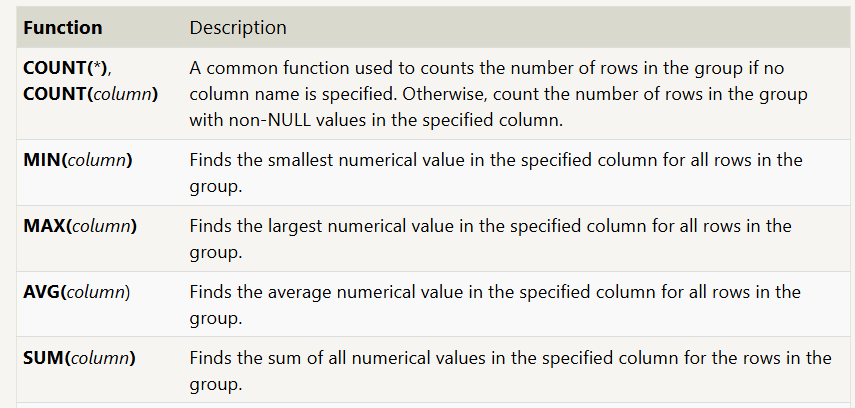
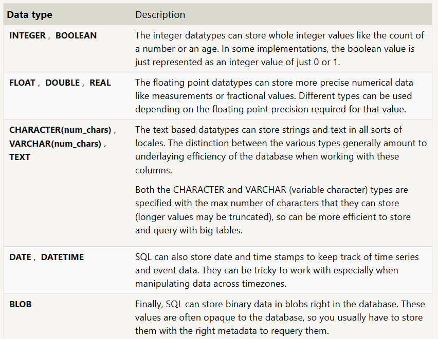
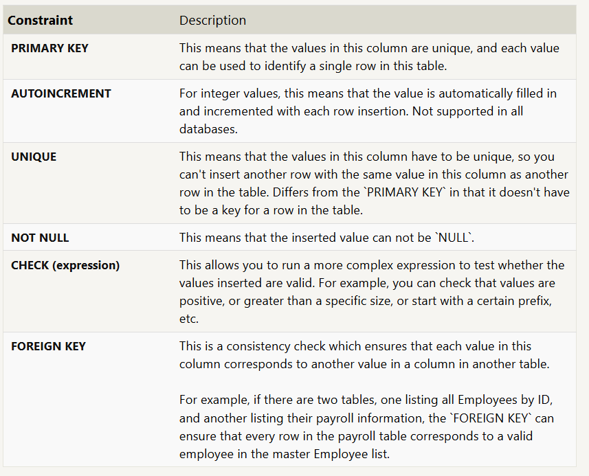

## Exercise 10 - Queries with aggregates

```sql
    SELECT AGG_FUNC(column_or_expression) AS aggregate_description, …
    FROM mytable
    WHERE constraint_expression;
```

- Without a specified grouping, each aggregate function is going to run on the whole set of result rows and return a single value. And like normal expressions, giving your aggregate functions an alias ensures that the results will be easier to read and process.



### Grouped Aggregate Functions

- In addition to aggregating across all the rows, you can instead apply the aggregate functions to individual groups of data within that group (ie. box office sales for Comedies vs Action movies).
  This would then create as many results as there are unique groups defined as by the GROUP BY clause

```sql
    SELECT AGG_FUNC(column_or_expression) AS aggregate_description, …
    FROM mytable
    WHERE constraint_expression
    GROUP BY column;
```

1. Find the longest time that an employee has been at the studio:

```sql
    SELECT max(years_employed) as longest_time FROM employees;
```

2. For each role, find the average number of years employed by employees in that role

```sql
    SELECT role, avg(years_employed) FROM employees group by role;
```

3. Find the total number of employee years worked in each building

```sql
    SELECT building, sum(years_employed) FROM employees group by building;
```

## Exercise 11 - Queries with aggregates 2

- The HAVING clause constraints are written the same way as the WHERE clause constraints, and are applied to the grouped rows.

```sql
    SELECT group_by_column, AGG_FUNC(column_expression) AS aggregate_result_alias, …
    FROM mytable
    WHERE condition
    GROUP BY column
    HAVING group_condition;
```

1. Find the number of Artists in the studio (without a HAVING clause):

```sql
    SELECT count(role) FROM employees where role = "Artist";
```

2. Find the number of Employees of each role in the studio:

```sql
    SELECT role, count(role) FROM employees group by role;
```

3. Find the total number of years employed by all Engineers

```sql
    SELECT sum(years_employed) FROM employees where role = "Engineer";
```

## Exercise 12

1. Find the number of movies each director has directed:

```sql
    SELECT director, count(director) FROM movies group by director;
```

2. Find the total domestic and international sales that can be attributed to each director

```sql
    SELECT director, sum(domestic_sales+international_sales) FROM movies inner join boxoffice on id=movie_id group by director;
```

## Exercise 13 Inserting rows

- When inserting data into a database, we need to use an INSERT statement, which declares which table to write into, the columns of data that we are filling, and one or more rows of data to insert

```sql
    INSERT INTO mytable
    VALUES (value_or_expr, another_value_or_expr, …),
       (value_or_expr_2, another_value_or_expr_2, …),
       …;
```

```sql
    INSERT INTO mytable
    (column, another_column, …)
    VALUES (value_or_expr, another_value_or_expr, …),
      (value_or_expr_2, another_value_or_expr_2, …),
      …;
```

1. Add the studio's new production, Toy Story 4 to the list of movies (you can use any director)

```sql
    insert into movies values (4,"Batman","Sai",2011,120 )
```

2. Toy Story 4 has been released to critical acclaim! It had a rating of 8.7, and made 340 million domestically and 270 million internationally. Add the record to the BoxOffice table.

```sql
    insert into boxoffice values(4, 8.7, 34000000,27000000)
```

## Exercise 14 Updating rows

- In addition to adding new data, a common task is to update existing data, which can be done using an UPDATE statement

```sql
    UPDATE mytable
    SET column = value_or_expr,
    other_column = another_value_or_expr,
    …
    WHERE condition;
```

**Always try to use a SELECT statement to verify before updating**

1. The director for A Bug's Life is incorrect, it was actually directed by John Lasseter

```sql
    update movies set director = "John Lasseter" where title = "A Bug's Life"
```

2. The year that Toy Story 2 was released is incorrect, it was actually released in 1999

```sql
    update movies set year = 1999 where title = "Toy Story 2"
```

3. Both the title and director for Toy Story 8 is incorrect! The title should be "Toy Story 3" and it was directed by Lee Unkrich

```sql
    update movies set title = "Toy Story 3", director = "Lee Unkrich" where id = 11
```

## Exercise 15 Deleting Rows

- You can use a DELETE statement, which describes the table to act on, and the rows of the table to delete through the WHERE clause.

```sql
    DELETE FROM mytable
    WHERE condition;
```

- If you decide to leave out the WHERE constraint, then all rows are removed, which is a quick and easy way to clear out a table completely (if intentional)

1. This database is getting too big, lets remove all movies that were released before 2005.

```sql
    Delete from movies where year < 2005;
```

2. Andrew Stanton has also left the studio, so please remove all movies directed by him.

```sql
    Delete from movies where director = "Andrew Stanton";
```

## Exercise 16 Creating Tables

- You can create a new database table using the CREATE TABLE statement.

```sql
    CREATE TABLE IF NOT EXISTS mytable (
    column DataType TableConstraint DEFAULT default_value,
    another_column DataType TableConstraint DEFAULT default_value,
    …
    );
```

### Data types



### Constraints



1. Create a new table named Database with the following columns:
   – Name A string (text) describing the name of the database
   – Version A number (floating point) of the latest version of this database
   – Download_count An integer count of the number of times this database was downloaded
   This table has no constraints.

```sql
    create table Database (
    Name text,
    Version float,
    Download_count integer
    );
```

## Exercise 17 Altering Tables

- ALTER TABLE statement to add, remove, or modify columns and table constraints.

### Adding Columns

- In some databases like MySQL, you can even specify where to insert the new column using the FIRST or AFTER clauses, though this is not a standard feature.

```sql
    ALTER TABLE mytable
    ADD column DataType OptionalTableConstraint
    DEFAULT default_value;
```

### Removing Columns

```sql
    ALTER TABLE mytable
    DROP column_to_be_deleted;
```

### Renaming table

```sql
    ALTER TABLE mytable
    RENAME TO new_table_name;
```

1. Add a column named Aspect_ratio with a FLOAT data type to store the aspect-ratio each movie was released in

```sql
    alter table movies add Aspect_ratio float;
```

2. Add another column named Language with a TEXT data type to store the language that the movie was released in. Ensure that the default for this language is English.

```sql
    alter table movies add Language text default "English"
```

## Exercise 18 Dropping Table

- In some rare cases, you may want to remove an entire table including all of its data and metadata, and to do so, you can use the DROP TABLE statement, which differs from the DELETE statement in that it also removes the table schema from the database entirely.

```sql
    DROP TABLE IF EXISTS mytable;
```

- In addition, if you have another table that is dependent on columns in table you are removing (for example, with a FOREIGN KEY dependency) then you will have to either update all dependent tables first to remove the dependent rows or to remove those tables entirely.

1. Drop Movies Table

```sql
    drop table movies;
```

2. Drop Box Office table

```sql
    drop table boxoffice;
```
