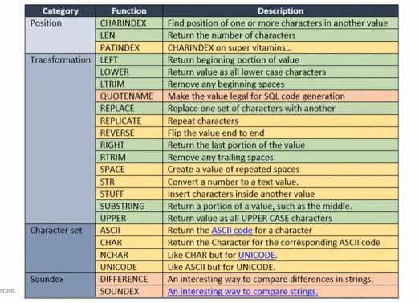
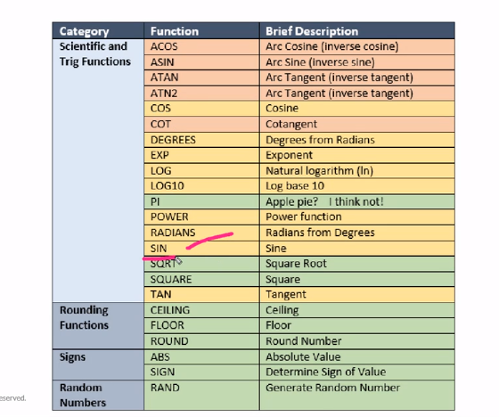
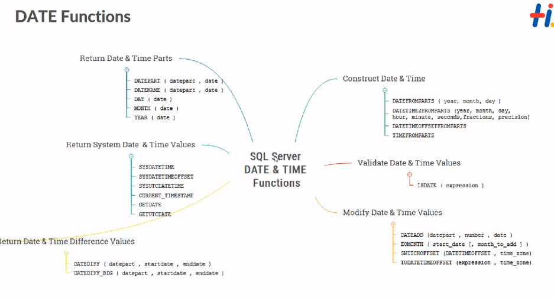

# ER Diagram

- It helps everyone to be in the same page

- Everyone can see the ER diagram and can easily understand the database design

- Everyone can comment on the Database design

- Helps in visualization of the database

## Inbuilt Functions

- String Functions
- Math Functions
- Date Functions



- LOWER
- UPPER
- LEN - length
- LTRIM - Remove beginning spaces
- RTRIM
- REVERSE
- REPLACE
- Soundex
  - Comparing the strings with the help of the sound

```sql
    select concat("Hello, "," ","ABC") as Msg;
```

```sql
    select upper('Sai') as Name;
```

```sql
    select lower("SAI") as Name;
```

```sql
    select LTRIM("     Sai") as Name;
    --Removes the spaces in the beginning
```

```sql
    select LEFT("Sai",2) as Name;
    --Displays the given number of character from the left
```

## Math Functions



## Date Functions



- DATE
- MONTH
- YEAR
- GETDATE
- DATEDIFF(datepart, startDate, endDate)
- DATEADD(Datepart, number, date)
