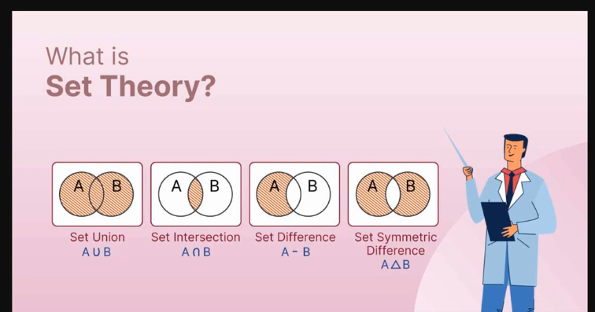
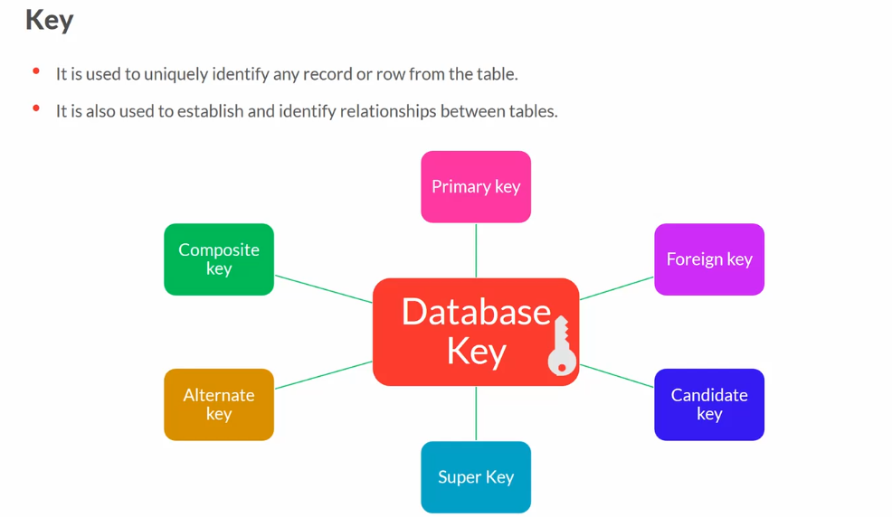
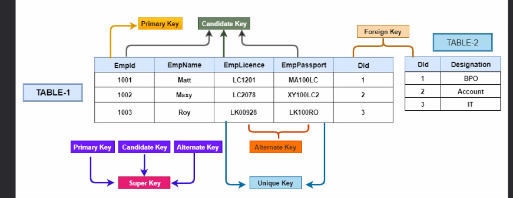
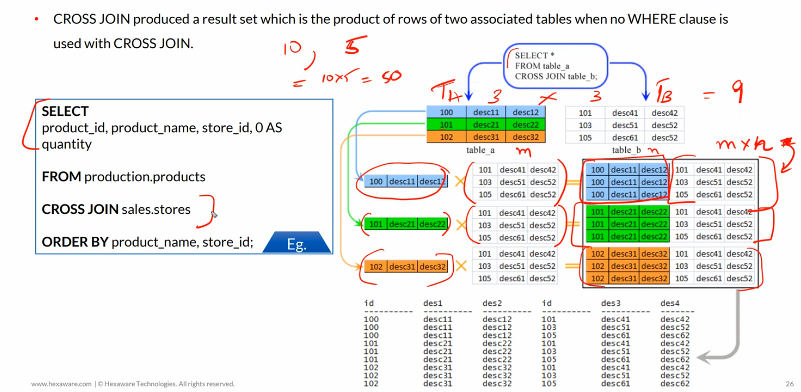

## Natural Join and Equi Join

- both works the same way as inner join

- Natural Join

  - No condition need to be give on joining
  - Column Name should be same between the two tables to let know sql which columns to join
  - Not available in mssql
  - Basic syntax :

  ```sql
    select * from employee natural join department
  ```

- Equi Join

  - Condition should be specified
  - Condition should always be about equality,
    it should always use '=' while joinning

## Declare Variables

```sql
    declare @d Date = GETDATE();
    select format(@d,'dd/MM/yyyy','en-US') as 'Date';
```

## Union/Intersect/Except (Set Operations)

- Union - Shows All the values in both the tables
- Intersect - Gives common items between list
- Except - Everything from Table A except the things that are available commonly in table B (A-B)

;

```sql
    --Intersect Example
    Select Department from Employees
    intersect
    Select AppliedFor from Applicants;

    --Union Example
    Select Department from Employees
    union
    Select AppliedFor from Applicants;

    --Except Example
    --Everything from Table A except from the things that are available in Table B (A-B)
    Select Department from Employees
    except
    Select AppliedFor from Applicants;

    --Order matters in Except
    Select AppliedFor from Applicants
    except
    Select Department from Employees;
```

## Keys





- Composition Key

  - Combination of multiple columns and these are used to identify all the rows involved uniquely

- Candidate Keys

  - Attributes which have the potential to become Primary key
  - Alternate Primary key
  - Unique and Not null like primary key

- Alternate Keys

  - Candidate keys that are not chosen as primary key

- Unique Key

  - It has unique values
  - Similar to Primary key but can accept NULL values

- Super Key

  - Combination or Super set of all the keys that can uniquely identify the records
  - Primary Key, Unique Key, Alternate key

- Composite vs Super Key

  - In Composite while combining both the column does not need to be unique independently, but when combined together are unique, but both should be not null.
  - In Super Key all the keys are unique

## ACID Properties

- Atomicity

  - The transaction should happen in one go.
  - There is transaction do not occur partially
  - Each transaction is considered as one unit and either runs to completion or is not executed at all.

- Consistency

  - The data should be consistent across the database.
  - The integrity must be maintained so that the database is consistent before and after the transaction.

- Isolation

  - Transactions must occur independently without interference
  - Multiple transactions can occur concurrently without leading to inconsistency of database state.

- Durability

  - The data that are stored in the database must persist and be safe even if there is a system failure.

## Cross Join

- It produces a result set which is the product of rows of two associate tables when no WHERE clause is used with cross Join


