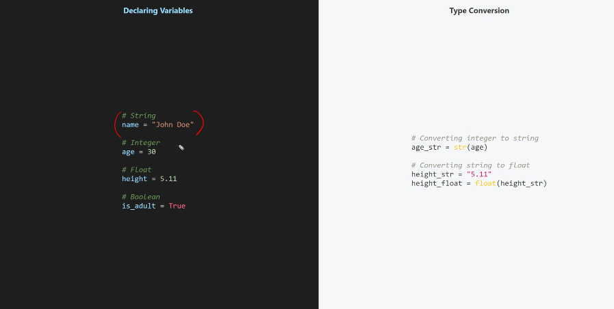

# Into to Python

- High level, interpreted. general purpose language

- Interpreted executes line by line while compiler compiles it into machine code and then executes

## Design Philosphy

- Aimed to be successor to ABC languge, appealing to unix, c

- Focuses on readability and simplicity

- Syntax allows expressing concepts in fewer lines of code

## Use Cases for python

- over 200 thousand packages in pypi

- Third party packages and library

- Numpy, Scipy, Pandas

- Frameworks like Django, Flask, Pyramid

## Application

- Web Development

- Data Analysis

- Automation and Scripting

- Software Development

## Basic Data Types



## Some operators specific to Python

- % - Modulus
- "\*\*" - Exponential
- // - Floor Division

- F strings

  ```python
  name = input()
  print(f"Hello, {name}!")
  ```

  - "{name}" is interpolation which is basically substituting variables

- Rules for Variables
  - Cannot have special symbols except underscore
  - Cannot start with a number
  - Cannot use reserverd keywords

## Setting up Python

### Virtual environment

- Open Powershell in vscode
  - python -m venv myenv

### Activate

- .\myenv\Scripts\Acitivate.psl

- Add env folder to gitignore
